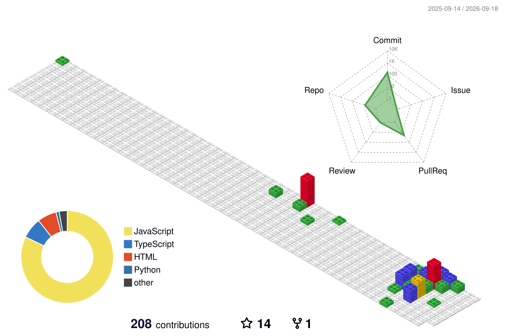

<h1 align="center">Olá, eu sou Airon Cavalcante</h1>

  18 anos | São Paulo, Brasil | Estudando Python e Análise de Dados

---

### Sobre mim

- Atualmente estou aprendendo Python
- Começando meus estudos em SQL, Excel e Análise de Dados
- Gosto de criar projetos para praticar o que estou aprendendo
- Tenho interesse em trabalho em equipe e colaboração

---

### Tecnologias

  

---

### GitHub Status

  

---

### Meus projetos

- [Simple Dictionary](https://github.com/Airon32/simple-dictionary)
- [Complex Calculator](https://github.com/Airon32/complex-calculator)
- [Dia das Mães](https://github.com/Airon32/dia-das-maes)
- [Finance Accountant](https://github.com/Airon32/finance-accountant-)

---

  Aprendendo e evoluindo um projeto de cada vez.

